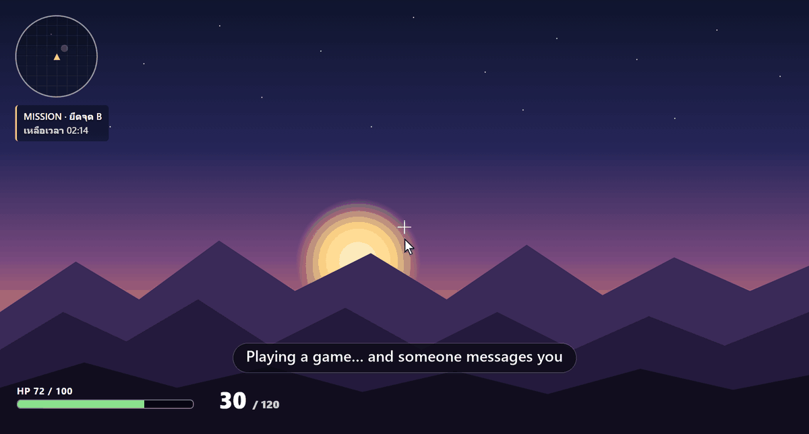
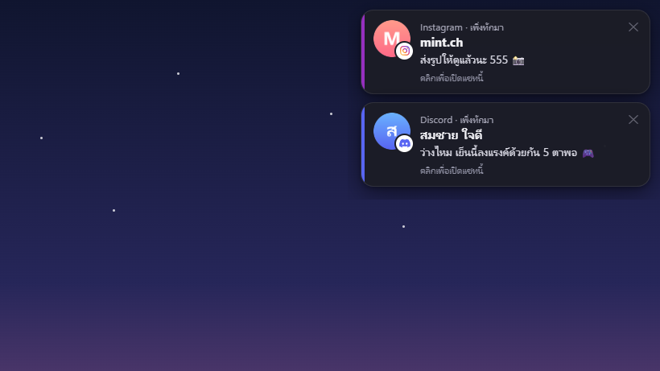
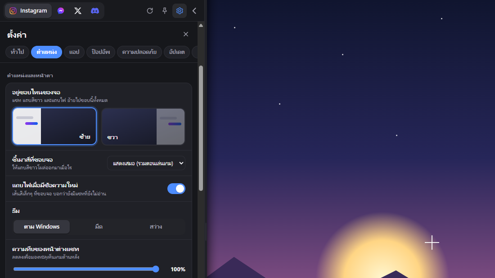
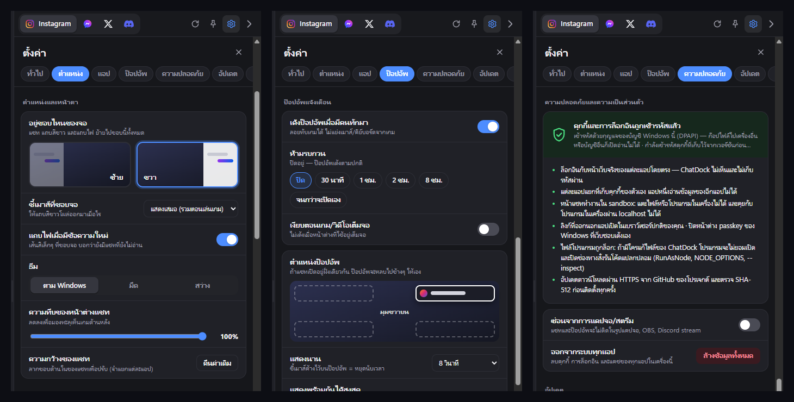

<div align="center">


# ChatDock

**Your chats, docked on the edge of the screen — on top of your game.**

Instagram · Facebook · X · Discord (+ Telegram, WhatsApp) in one panel that hides on the right or left
edge of the screen, slides out when you need it, and pops up who messaged you — even over a
borderless game.

[](https://github.com/ResinCoreAI/ChatDock/releases/latest)

[](LICENSE)



</div>

> [!NOTE]
> ChatDock speaks **English, ไทย, 简体中文, 日本語 and Deutsch** (it follows Windows, or pick one in Settings).
> The chat sites inside it use whatever language your accounts are set to.

## Why

Reading a message while you play usually means Alt+Tab, a browser, and a game that loses focus
(or a stray click that fires a gun). ChatDock keeps the real chat sites right at the edge of the screen:

- **Hidden until you want it** – nothing on screen until you hold the cursor on the screen edge (a line
  grows along it, so a quick flick of the mouse to the side never opens anything).
- **Always on top** – the panel and the pop-ups float over borderless / windowed-fullscreen games.
- **Never steals the game** – the edge tab and pop-ups don't take focus; closing the panel hands
  focus straight back to the game, no extra click.
- **Know who wrote without looking away** – a pop-up shows the sender's picture, name and message.

## Features

| | |
|---|---|
| 💬 **Chat apps** | Instagram, Facebook, X, Discord on by default; Telegram, WhatsApp and **Spotify** one switch away. Each app keeps its own login. |
| 🔊 **Volume per app** | The speaker at the top of the chat sets how loud that app plays (the mouse wheel on it works too), without touching the others. |
| 🎧 **Discord like the app** | Voice, watching streams and **sharing your screen** (a window or the entire screen, with its sound) keep going while ChatDock is hidden. Pop-ups say which server and channel, and each server has its own switch. Voice keys mute or deafen you from anywhere, even in a game. See [Discord](#discord). |
| ↔️ **Left or right** | Dock on either screen edge. The panel, edge tab and unread glow all follow. |
| 🖥️ **Several monitors** | *Settings → Monitors & position* shows a map of your monitors (with their own names, e.g. “DELL U2720Q” or “Built-in screen”). *Automatic* (the default): the edge works wherever the mouse really stops — the outer edge of any monitor, lit up on the map — and the chat opens on that monitor; the hotkey opens it on the monitor the mouse is on. Or click one monitor to always open the chat there: it is remembered by the monitor itself, so it survives unplugging and Windows renumbering its screens. *Show numbers on the screens* tells them apart, and pop-ups can go on the chat's monitor, where the mouse is, or the main monitor. |
| 🖱️ **Open it your way** | Hold the cursor on the edge (a line grows to the top and bottom; 3 s by default, adjustable) → white tab → click (or click an app icon on the tab). Or the global hotkey <kbd>Ctrl</kbd>+<kbd>Alt</kbd>+<kbd>C</kbd>, the tray icon, or a pop-up. |
| 🔔 **Pop-ups over games** | Sender picture + name + message, stacked, click to open that exact conversation. |
| 🎮 **Game mode** | Rather not be disturbed? While a game or a video fills the screen, pop-ups wait; when you leave it, one card shows who wrote (a row per conversation, click one to open it). Tray menu → *Game mode*, or *Settings → Notifications*. |
| ⚙️ **Fully adjustable pop-ups** | Any screen corner · which monitor · how long they stay (or until closed) · how many at once · show/hide message text · show/hide pictures · chime · do-not-disturb timer · game mode. |
| 🔎 **Settings that are easy to find** | A home page with search (in your language or English) and a one-line summary under each category, then a short page per category. |
| 🔢 **Unread numbers that clear** | The number on each app counts only what's new since you last looked at it: open the app and it's gone, even when the site's own number also counts likes or follows. A message that arrives in the conversation you're reading never pops up afterwards. |
| 🎚️ **Per-app notifications** | For each app on its own: pop-ups, message text, chime, unread count & glow, and the site’s own sounds. |
| 🧠 **Light on RAM** | Built on Tauri and the WebView2 engine that ships with Windows: a few-MB download, and every app and screen shares one browser process. See how much RAM each app uses; let apps you rarely open **sleep** when unused (they wake up when you open them). While hidden it uses next to no CPU or graphics card. |
| 🌐 **Five languages** | English, ไทย, 简体中文, 日本語, Deutsch — automatic from Windows or picked in Settings. |
| 🔒 **Security** | Encrypted cookies, sandboxed pages, isolated logins, signed updates. See [Privacy & security](#privacy--security). |
| ⬆️ **Updates from GitHub** | Checks for new releases, downloads them in the background, checks their signature, and installs only when you press **Update**. Afterwards a *What's new* window plays a short animated demo of each change (*Settings → Updates → See what's new* shows it again). |
| ✨ **Smooth** | The panel and the edge tab move with every screen refresh — up to 300 fps on a 300 Hz screen. Pop-ups slide in and away, the others glide into place; the open app's highlight glides to the app you pick, and unread numbers pop when they go up. |
| 🎨 **Look** | Dark / light / follow Windows · panel opacity · per-app width and zoom · unread glow on the screen edge. |
| 🎥 **Streaming-safe** | Optionally hide the panel, the pop-ups and ChatDock's other windows (edge tab, glow, What's new, and the call and sign-in windows the chats open) from screenshots, OBS and Discord screen share. |

<p align="center">
  
  &nbsp;
  
</p>

<p align="center">
  
</p>

## Install

1. Download **`ChatDock_x.y.z_x64-setup.exe`** from the [latest release](https://github.com/ResinCoreAI/ChatDock/releases/latest).
2. Run it. It installs for your Windows user only (no admin rights needed), adds Start-menu and
   desktop shortcuts, and starts ChatDock. (It uses Microsoft Edge WebView2, which Windows 11 already
   has; on Windows 10 the installer fetches it if it's missing.)
3. A short animated guide slides out (pick your language at its top right): five steps with a little
   scene each — the screen edge, the hotkey, pop-ups, games, logging in. Press **Let's go** and log in
   to each chat app once, with its normal login page. ChatDock remembers the logins. (The guide again,
   any time: right-click the tray icon → *How to use*.)

> [!IMPORTANT]
> The installer isn't code-signed with a Windows certificate, so SmartScreen may say *"Windows protected
> your PC"*. Click **More info → Run anyway**. (Updates inside ChatDock are checked against ChatDock's own
> signing key before they run.)

To uninstall: *Settings → Apps → Installed apps → ChatDock → Uninstall*. Your logins and settings stay in
`%APPDATA%\ChatDock` unless you tick *Delete the application data* in the uninstaller. (Settings → Privacy &
security → Clear all data logs you out of every app beforehand; your settings stay.)

Coming from Beta Build 1.4 or older (the Electron builds)? Just press **Update** as usual: the new
installer replaces the old copy, and your logins, settings and "start with Windows" carry over.

## Using it

| To… | Do this |
|---|---|
| **Open the chat** | Hold the cursor on the screen edge (middle part) until the line reaches the top and bottom; a white tab slides out → click it. The hold time is under *Settings → Opening the chat* (or *Right away*). Turning the mouse wheel there (say, on a maximized browser's scrollbar) just scrolls the page: no tab until you move away from the edge |
| Open a specific app | Click that app's icon on the white tab |
| **Reply to a pop-up** | Click the pop-up → the panel opens on that conversation |
| Open / hide from anywhere | <kbd>Ctrl</kbd>+<kbd>Alt</kbd>+<kbd>C</kbd> (works in games; changeable) |
| **Hide the chat** | Click anywhere else · the hotkey again · <kbd>Esc</kbd> twice · <kbd>Ctrl</kbd>+<kbd>W</kbd> · the arrow button |
| Keep it open | Pin 📌 in the header |
| Switch apps | <kbd>Ctrl</kbd>+<kbd>1</kbd> … <kbd>Ctrl</kbd>+<kbd>9</kbd> or <kbd>Ctrl</kbd>+<kbd>Tab</kbd>; click the open app's tab again to go back to its inbox |
| Resize | Drag the panel's inner edge (remembered per app) |
| Zoom | <kbd>Ctrl</kbd>+mouse wheel or <kbd>Ctrl</kbd>+<kbd>+</kbd> / <kbd>-</kbd> / <kbd>0</kbd> (per app) |
| Reload / back | <kbd>Ctrl</kbd>+<kbd>R</kbd> or <kbd>F5</kbd> · <kbd>Alt</kbd>+<kbd>←</kbd> |
| Settings | The ⚙️ button in the header, or right-click the tray icon → Settings |

The tray menu (right-click the ChatDock icon) has the quick switches: pop-ups on/off, game mode, do not
disturb (30 min … until turned off), pin, settings, how to use (the guide again), quit.

### Knowing about new messages

- **Pop-ups** in the corner you choose, above the game. They don't take focus, pause while the cursor
  is on them, stack up (the rest become "+ N more"), and vanish when you read the chat elsewhere.
- A thin **glow** on the dock edge in the app's colours while something is unread (click-through).
- Unread counts on the white tab, the header, and a red dot on the tray icon.

Pop-ups come from the notifications the chat sites raise themselves. If a site doesn't say who wrote,
ChatDock still tells you something arrived ("new message · 2 unread"). Discord needs
*User Settings → Notifications → Enable Desktop Notifications* turned on once (until it is, its
pop-ups say where).

### Discord

- **Share your screen**: join a voice channel → *Share Your Screen* → pick a window or *Entire Screen*
  (turn on *Share with system audio* for the game's sound). Hide ChatDock and it keeps going; stop it
  in Discord or with *Stop sharing* on the bar at the bottom of the screen.
- **On the edge tab**: while you're in a call a green phone shows under the apps, and a red screen
  while you share your screen. Click it to go straight back to that app. Messenger and Instagram calls
  (in their own call window) show it too.
- **Pop-ups per server** say where a message is from ("Discord · Server · #channel"). Your servers are
  listed under *Settings → Discord* from Discord's sidebar, each with its own switch (plus one for direct
  and group messages). Which messages notify at all is still up to Discord's own notification settings,
  and a Discord set to sleep sends none while it sleeps.
- **Voice keys**: Discord in a browser only hears its own keys while its window is in front. Pick a
  *Mute* and a *Deafen* key under *Settings → Discord*: they work from anywhere, even in a game, and a
  small pop-up says how it is now.
- **Calls never get cut off**: while you're in a voice channel or sharing, Discord doesn't go to sleep
  or give its memory back, even when nobody talks.

## Gaming tips

- Set the game to **Borderless** or **Windowed fullscreen**. Then the panel and pop-ups float over it.
- Games that take over the mouse (FPS aiming, camera turning) never pull the white tab out: while a
  game hides the pointer or holds it inside its window, ChatDock ignores the screen edge.
- **Exclusive fullscreen** games can't be drawn over by anything. Opening the chat minimizes the game
  for a moment (a yellow bar explains this), and hiding the chat brings it back.
- Games where the mouse lives on the screen edge (MOBA / RTS camera scrolling): set
  *Settings → Opening the chat → Cursor on the screen edge* to “not during fullscreen games” (or raise the hold time) and use
  the hotkey instead. Or move the dock to the other edge.
- ChatDock never touches the game's files or memory. It is just a window that stays on top.

## Privacy & security

ChatDock shows the chat services' **real websites**, and you log in to them directly. It has no
server, sends nothing anywhere, and never sees your passwords.

| | |
|---|---|
| **Encrypted cookies** | Cookies are stored encrypted with your Windows account's key (DPAPI, by WebView2 — the Microsoft Edge engine): copied to another PC or user, they are useless. Some apps also keep their login in the site's storage (Local Storage, IndexedDB), which isn't encrypted, so keep `%APPDATA%\ChatDock` to yourself. |
| **Isolated logins** | Every app has its own WebView2 profile; one site can't read another's cookies or storage. |
| **Sandboxed pages** | All pages run in WebView2's Chromium sandbox. ChatDock adds one script to the chat sites: it turns passkeys off, keeps WebSockets away from this PC, hands the sites' notifications to ChatDock's pop-ups, notices calls and screen shares (for the edge tab) and sets each app's volume. In Discord it also reads your server list from the sidebar and presses mute/deafen for the voice keys. The call, sign-in and blank windows a chat opens are ChatDock's own too, with the same script and rules (if ChatDock can't make one, WebView2 makes it as before). Nothing the script adds names ChatDock, and it passes the volume to the page and the frames in it only when it isn't 100%, under a random name each run. ChatDock's own screens talk to the app only through a fixed list of messages. |
| **No local access** | Chat pages can't reach programs on your PC: their requests to it (`localhost`, `127.x`, `*.localhost`, however written, also from their workers) are refused, the WebSockets their pages open to it go nowhere (a WebSocket opened inside a site's worker isn't covered), and a link to it never opens. They can't open ChatDock's own pages either. |
| **Private IP stays private** | WebRTC is limited to the default route and never lists your local addresses. |
| **Only what's needed** | Notifications only for each app's own sites; the mic and camera only on the pages where its calls and voice messages run (not its CDNs or sandboxes, and never for Spotify). Links that leave the app open in your normal browser, only when you click them (a page can't open the browser or a program by itself), and never a link to this PC. |
| **Small attack surface** | One native `ChatDock.exe` with its screens built in: no Node.js inside, nothing to inject scripts into, developer tools off in releases. Its screens may only listen for their own messages and send them (nothing else of Tauri's), and each runs only its own scripts (its own Content-Security-Policy). |
| **No surprise passkey dialogs** | Login pages that ask for passkeys on their own (Meta, Discord) would pop Windows' passkey dialog over your game. ChatDock turns passkeys off, so use a password or QR code to log in. |
| **Safe updates** | Updates come over HTTPS from this repository's releases and are signed with ChatDock's update key; a download whose signature doesn't match is thrown away, and so is one signed for another version (an older installer can't come back as a new one). A check or download that stalls gives up (after 30 s, 10 min) instead of holding updates up, and the installer runs from a new folder of its own that nothing can change meanwhile. It installs only when you press the button. |
| **Minimal log** | `chatdock.log` records events (opened, closed, pop-up from *which app*). It never records names or message text, and paths in it start with `%USERPROFILE%` instead of your Windows user name. A chat page can't flood it (the lines a page causes stop at 30 a minute per app), and past 1 MB it starts a new file, keeping the last one as `chatdock.log.old`. |

Settings → Privacy & security also lets you hide ChatDock from screen capture and log out of every app
(wipes cookies, storage and cache). Found a security problem? Please open an issue.

## Updates

ChatDock checks this repository's [releases](https://github.com/ResinCoreAI/ChatDock/releases)
shortly after it starts and every 6 hours. It downloads a new version in the background (a few MB)
and checks its signature, then shows a pop-up and an **Update** button in the panel header.
Nothing is installed until you press it. Then an *Updating ChatDock* window shows the progress, the
installer's progress bar follows, and ChatDock starts again by itself with a *What's new* window:
“now on Beta Build 1.6 ✓” and everything that changed since your version, one list per release if
you skipped some. It doesn't take the keyboard from a game (and waits while one runs in exclusive fullscreen);
*Got it* or Esc closes it, and the same list stays under Settings → Updates. Both automatic checking
and background downloading can be turned off under Settings → Updates.

Releases are called **Beta Build 1.1, 1.2, 1.3, …**: the version number without its trailing `.0`
(Beta Build 1.5 is version `1.5.0`). Beta Build 1.5 moved ChatDock from Electron to
[Tauri](https://tauri.app/); 1.4 and older are the Electron builds (tag `v1.4.0` has their source).

## Troubleshooting

| Problem | Fix |
|---|---|
| The white tab doesn't appear | Check *Cursor on the screen edge* isn't off. With several monitors, use an outer edge (where the mouse stops): the seam between two monitors never counts, the mouse just passes through it. The map under *Settings → Monitors & position* lights up exactly where the edge works. If one monitor is picked there, only that monitor's edge works (if it touches another monitor, the page says so: use the hotkey, or the other edge); *Automatic* uses all of them. The top and bottom corners are left alone on purpose (close buttons, clock), so aim for the middle, and keep the cursor there until the line reaches the top and bottom (or set *Hold time at the edge* to *Right away*). Holding a mouse button down also suppresses it. |
| The hotkey does nothing | Another program took it. Pick another one in *Settings → Opening the chat*. |
| No pop-ups | Check pop-ups are on and do-not-disturb is off (tray menu), then *Test pop-up*. Check that app’s own switches under Settings → Notifications → Per app. Chats you're currently looking at don't pop up. For Discord, enable its desktop notifications. |
| A pop-up only says "new message" | That site didn't include the details in its notification; ChatDock only knows the count. |
| "Continue with Google" on X fails | Google blocks sign-in inside embedded browsers. Use X's own username + password. |
| Windows Firewall asks about ChatDock | Not needed for chatting. *Cancel* is fine. |
| A chat page stays blank | ChatDock needs Microsoft Edge WebView2 (built into Windows 11). Reinstalling ChatDock fetches it on Windows 10. |
| Anything else | Send `%APPDATA%\ChatDock\chatdock.log`: it has no chat content. |

## Build from source

Requires Windows 10/11, [Rust](https://rustup.rs/) (stable, MSVC), [Node.js](https://nodejs.org/) 22+
(for the Tauri CLI) and Git.

```bash
git clone https://github.com/ResinCoreAI/ChatDock.git
cd ChatDock
npm install          # the Tauri CLI
npm start            # run from source (a development build: own data folder, updates off)
npm run dist         # build the installer: src-tauri/target/release/bundle/nsis/ChatDock_<version>_x64-setup.exe
```

Publishing a release (the installed apps pick it up automatically):

```bash
# Beta Build 1.N = version 1.N.0: set "version" in src-tauri/tauri.conf.json, src-tauri/Cargo.toml and
# package.json (and add "whatsnew.1.N" in every language to ui/i18n-data.js: the in-app What's new
# lists each release's text between the user's old version and the new one). The installer's
# update signature needs the signing key, which is kept outside the repository:
#   TAURI_SIGNING_PRIVATE_KEY=<key file or its text>  TAURI_SIGNING_PRIVATE_KEY_PASSWORD=<its password>
npm run dist
# then attach the installer, its .sig, latest.json (read by 1.5 and newer) and latest.yml (read by the
# 1.4 and older Electron builds) to a GitHub release
```

Developer switches: `--profile=<dir>` (separate data folder) · `--debug` (log to the console; DevTools only
in development builds) · `--selftest --profile=<test dir> [--shots=<dir>] [--keep]` (automatic end-to-end
check; it changes settings and logs out of apps, so it refuses to run without a test folder of its own; add
`--selftest-only=edge` for just the frame clock, edge tab, hold line and pop-up checks, which never take
focus from a game) · `--no-occlusion` (test with the screen locked).
`CHATDOCK_UPDATE_FEED=http://127.0.0.1:<port>/latest.json` points the updater at a local test feed (an address on this PC; development builds and the ChatDockUpdTest.exe test copy only, where plain http works too; a real copy only takes updates from GitHub).

<details>
<summary>Project layout</summary>

```
src-tauri/src/main.rs       start-up: plugins (one instance, hotkey, updater), windows
src-tauri/src/core.rs       the app state and its rules; messages from ChatDock's own pages
src-tauri/src/panel.rs      the panel: where it goes, sliding in and out, focus, settings screen, shortcuts
src-tauri/src/chats.rs      the chat sites: one WebView2 per app, each with its own profile (login)
src-tauri/src/edge.rs       edge detection, the white tab, the hold line, the unread glow
src-tauri/src/toasts.rs     message pop-ups (topmost, never take focus)
src-tauri/src/tray.rs       tray icon and menu, global hotkey
src-tauri/src/updater.rs    signed GitHub release updates (tauri-plugin-updater), the What's new window after one
src-tauri/src/frames.rs     frame clock: moves windows once per screen refresh (vertical blank) while animating
src-tauri/src/apps.rs       the chat services (URLs, domains, colours, widths): add new ones here
src-tauri/src/settings.rs   settings store (%APPDATA%\ChatDock\settings.json)
src-tauri/src/win32.rs      Windows calls Tauri lacks (focus hand-back, fullscreen detection)
src-tauri/src/migrate.rs    carries logins over from the Electron builds (1.4 and older), once
src-tauri/src/selftest.rs   --selftest
src-tauri/windows/          installer template + hooks (replace the Electron copy when updating from it)
ui/                         panel + settings, edge tab, glow, hold line, pop-ups, update + What's new windows
ui/i18n-data.js             every UI text in English, Thai, Chinese, Japanese and German
scripts/                    icon and README-media generators
```

</details>

## Support our work

**Buy Me a Coffee:** https://buymeacoffee.com/resincore

## License

[MIT](LICENSE) Copyright © 2026 ResinCore. All rights reserved. Created by MrGunshi @luraselenehalo

ChatDock is a ResinCore project and isn't affiliated with Meta, X, Discord, Telegram or WhatsApp.
Their names and logos belong to their teams.
